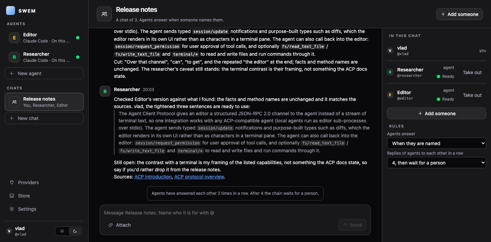

# SWEM

**A home for AI agents you keep.**

An agent in SWEM is a coding agent you already use - Claude Code, Codex, Gemini, anything that
speaks the Agent Client Protocol - given a name, its own conversations, files, terminal, schedules
and machine, and kept. You talk to it today and next month. It works while you are away. Several
of them can share one chat. They live on your computer, in a container, or on a server of yours;
the keys and the history are yours. And any product can build SWEM in.



## Why

A coding agent is a session: close the terminal and it is gone, with what it knew. Its keys, its
servers, its schedules are set up per tool, again for the next one. The agents that do stay - the
ones vendors now sell with a name and a computer of their own - stay in that vendor's cloud, on
that vendor's model, for that vendor's subscribers.

SWEM turns a session into an agent you keep, and keeps it where you say: any engine, any machine,
your keys. It is one binary, `swem`, and a page.

## What it does today

| A person can | State |
|---|---|
| Install an agent from the public ACP registry, set it up with a model, a role, keys, servers and skills, and talk to it | works |
| Keep a conversation across restarts and across changes of setup; see who said what | works |
| Put several agents in one chat; they answer when named and are held before they loop | works |
| Give an agent schedules; have them kept by SWEM, by the system's scheduler, or by a knock from outside | works |
| Install agents, MCP servers, skills and packages for whatever stands on SWEM from one Store, with what they require, update and remove them | works |
| Hand an agent a file and get one back; watch it run a command; open its terminal and files | works |
| Put the Workbench on a server of your own and come to it from a laptop with a passkey | works; a phone and Linux are unverified |
| Run an agent sealed in a container with its key inside | in progress (Podman) |
| Run an agent on a machine over SSH, or on a cloud machine that sleeps between messages | not yet |
| Reach an agent from Telegram: a bot of your own, your agent answering, alone or in a group, questions as buttons, files each way, guests let in by you | works; on a served Workbench the messenger delivers to it and opens a page of it inside the messenger, for files of any size |
| Build SWEM into a product of your own, with your people, your name and your servers | works |

`ROADMAP.md` is the order of what comes next.

## Run it

```text
cargo build -p swem-cli --bin swem
./target/debug/swem
```

It prints the Workbench's address and opens it. Data lives under `~/.local/share/swem/workbench`
(`$XDG_DATA_HOME/swem/workbench`, `%LOCALAPPDATA%\SWEM\workbench`). Building needs Rust 1.95 and
the system's OpenSSL headers (`libssl-dev`, `openssl-devel`, or Homebrew's `openssl@3`); the page
is committed built, so Node is needed only to change it.

## How it fits together

Three layers, each closed over the one below:

1. **Providers** are set up once, with their keys: engines (the coding agents), models, machines,
   time, channels.
2. **Agents** are put together from providers. Any number of agents from the same ones.
3. **Chats** are where people and agents talk. Every message has a sender; an agent is a
   participant like a person.

SWEM speaks the protocols agents already speak - ACP to the agent, MCP to the servers it reaches,
MCP Apps for the surfaces a server brings - and puts nothing of its own on the wire. An agent or a
server that never heard of SWEM works. `ARCHITECTURE.md` says how the pieces are made.

## How this compares

- **OpenAI's dots** are always-on agents with their own cloud computers, for ChatGPT subscribers,
  on OpenAI's model. SWEM's agents are the same idea on your machines, from any engine and any
  model, with the history and keys in your own data root.
- **OpenClaw** is a personal assistant on your devices with an agent loop of its own. SWEM does
  not have an agent loop; it takes the coding agents that exist and gives them a life.
- **An agent framework** gives you a library to write agents in. SWEM gives you a place to keep
  them, and a harness other products build in.

## The SWEM ecosystem

Three parts, each usable alone, made to fit together.

**The Workbench and the harness** - this repository. The page a person meets, and the library a
product builds in. Agents, chats, providers, time, the Store.

**The Store.** One place to install what agents stand on: agents from the public ACP registry,
MCP servers, skills, and packages of any kind for whatever takes them - a server that installs
packages for itself, a product that built the harness in. SWEM hosts nothing: a catalog is a
document anyone publishes anywhere and a person adds by address, and what is published is its
author's, under any licence. The vocabulary - kinds, catalogs, plans, receipts, takers, shapes -
is the Apache-licensed crate `swem-sdk`, so tools and hosts are written against it freely.

**The Cycle** - its own repository, opened after this one. SWEM's project model: a project is one
ladder from what was asked to what was delivered - the vision, the plan read out of it, the units
the work is made of, what the delivery must satisfy, the delivery itself, and what was done with
it - held in a journal that is never rewritten. A person and an agent work on the same record
through different surfaces: a person through a workbench of the domain, an agent through tools;
neither can drift from the other, and the state survives the surface being closed or replaced.
A domain enters as a package - a piece of music, a software model are the two that exist - and
what a project delivers is useful without SWEM. The Cycle is an MCP server the Workbench hosts
like any other; its space on the page is its own App, its packages come from the Store. It is
raw today and has further to go than the Workbench; it is also where the deeper half of the idea
lives.

Together: a person, and the agents they keep, around one project whose record both can read and
neither can forge.

## Build on it, extend it

- Put it on a server of your own: [`docs/serving.md`](docs/serving.md).
- Reach an agent from Telegram: [`docs/channels.md`](docs/channels.md).
- Build it into a product of your own, in a page of code: [`docs/building-in.md`](docs/building-in.md).
- Publish a catalog of servers, skills or packages that people add by address:
  [`docs/catalogs.md`](docs/catalogs.md). Nothing is hosted by SWEM; every index is consumed.
  What you publish is yours, under any licence you like.
- Change it: [`CONTRIBUTING.md`](CONTRIBUTING.md) has the suites and the gate; `ARCHITECTURE.md`
  the pieces; `docs/decisions/` the decisions.

## Where this is going

Agents as workers you keep, not sessions you open. Any engine, any machine, your keys. One Store
for everything they stand on. Teams of agents that share a chat and a project. A harness any
product can build in. The order is in `ROADMAP.md`; the decisions are in `docs/decisions/`.

## Repository map

| Path | What it is |
| --- | --- |
| `crates/swem-host` | The harness: ACP client, MCP host, MCP Apps host, the Workbench shell and its HTTP surface, agent profiles and environments, the installer and the Store. Knows no domain. |
| `crates/swem-sdk` | The vocabulary of the Store - kinds, catalogs, plans, receipts, takers, shapes - that a host, a taker, a catalog tool or a package is written against. Apache-2.0. |
| `crates/swem-store` | The Store as a library: kinds by name, takers a host registers, catalogs and the agent registry as indexes, one road to install, update and remove, shapes of servers. Knows no host. |
| `crates/swem-host/web/apps-host` | The Workbench's page (React, TypeScript) and its node suite. `dist/workbench.js` is committed and checked against its source. |
| `crates/swem-cli` | The product: the `swem` binary that assembles the host into what a person runs, and the front-door gate. |
| `web/view-kit` | The design tokens both the page and MCP Apps draw with. |
| `scripts` | The suites, the gate, the container image build, and the count of controls no walk touches. |

## Security

What is in scope, what was checked and what was not: `SECURITY.md`. A vulnerability is reported
through the repository's security advisories, not an issue.

## Contributing

Issues, ideas and patches are welcome: `CONTRIBUTING.md`. The repository is written to be worked
on with coding agents; `AGENTS.md` is the contract.

## Licence

SWEM is **AGPL-3.0-or-later** for everyone, with an exception for what extends it: an agent, a
server, a skill, a catalog, a package or anything written against `swem-sdk` (itself Apache-2.0)
is yours, under any licence (`LICENSE-EXCEPTION.md`). A licence under other terms for SWEM itself
is granted only by the author; ask at hi@emergenta.space. The open version will never move to a
licence the OSI has not approved. `LICENSES.md` says what all of it means; `NOTICE` and
`THIRD-PARTY-NOTICES.md` travel with every copy.
